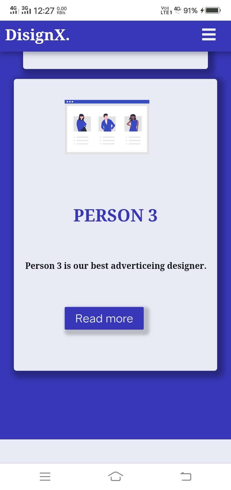

# designer-portfolio
**This is a simple portfolio for a designer company developed using HTML and CSS . It is responsive website compatible for all devices.**

**The screenshots of the above project is given below**

**This website is responsive also**

Home page of the website

About page of the website

Works page of the website

Experts page of the website

Contact page of the website

**The mobile responsive screenshots also provided below**

Home page with responsive navigation bar

  

About page

Works page with responsive cards and hover effects

         

 

Experts page with responsive cards and hover effects

         

 

Contact page 

         

 

